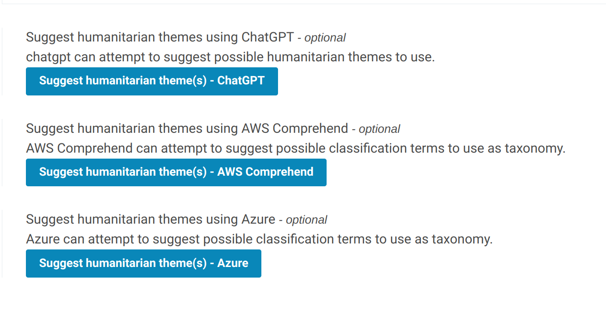
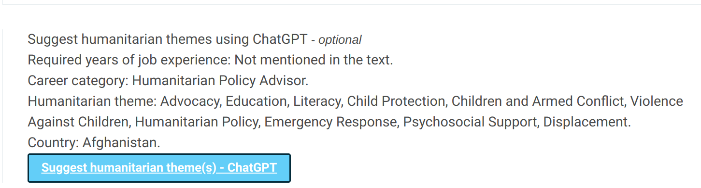
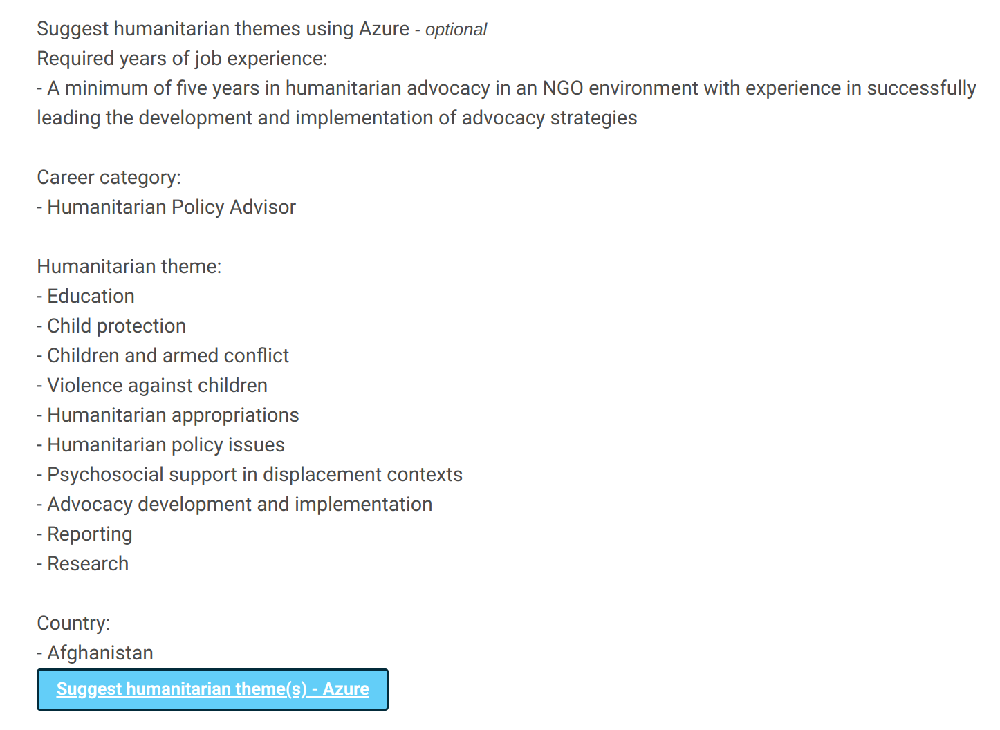
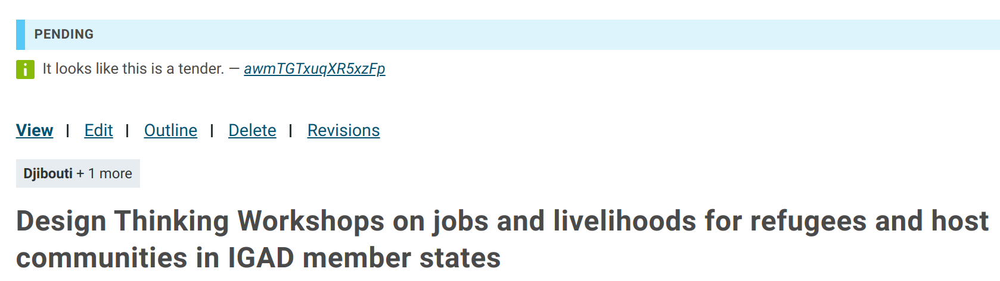

# POC Open AI

Various test integrations using ChatGPT, Azure and AWS Comprehend.

To be able to use *AWS Comprehend* you need to start the endpoint using `drush reliefweb_openai:aws_endpoints:create`,
keep in mind that this will cost money while running.

## Config

File `html/sites/default/settings.local.php`

```php
$config['reliefweb_openai.settings']['token'] = '';
$config['reliefweb_openai.settings']['aws_access_key'] = '';
$config['reliefweb_openai.settings']['aws_secret_key'] = '';
$config['reliefweb_openai.settings']['aws_region'] = 'eu-central-1';
$config['reliefweb_openai.settings']['aws_endpoint_theme_classifier'] = 'arn:aws:comprehend:eu-central-1:694216630861:document-classifier-endpoint/rw-themes';
$config['reliefweb_openai.settings']['azure_endpoint'] = 'https://tst003.openai.azure.com/openai/deployments/tst003/chat/completions?api-version=2023-03-15-preview';
$config['reliefweb_openai.settings']['azure_apikey'] = '';
```

## Drush commands

```
drush reliefweb_openai:train_jobs           Train jobs.
drush reliefweb_openai:status               Jobs status.
drush reliefweb_openai:results              Jobs status.
drush reliefweb_openai:test_jobs            Test it
drush reliefweb_openai:job_categories       Job categories from API.
drush reliefweb_openai:job_categories_test  Job categories from API.
drush reliefweb_openai:summarize_pdf        Summarize a PDF.
drush reliefweb_openai:aws_endpoints:list   List endpoints.
drush reliefweb_openai:aws_endpoints:create Create endpoint.
drush reliefweb_openai:aws_endpoints:delete Delete endpoint.
```

## Forms

Extra buttons are added to job edit form to ask AI for required year of experience, career category, list of humanitarian themes and primary country
based on the body text.

Extra buttons are added report edit form to ask AI for a list of humanitarian themes and primary country
based on the body text.



### ChatGPT

Model: gpt-3.5-turbo-16k
Prompt: **Extract the required years of job experience, career category, humanitarian theme (One of Agriculture, Camp Coordination and Camp Management, Climate Change and Environment, Contributions, Coordination, Disaster Management, Education, Food and Nutrition, Gender, Health, HIV/AIDS, Humanitarian Financing, Logistics and Telecommunications, Mine Action, Peacekeeping and Peacebuilding, Protection and Human Rights, Recovery and Reconstruction, Safety and Security, Shelter and Non-Food Items, Water Sanitation Hygiene) and country from the text below.**



### Azure

Model: gpt-3.5-turbo-16k
Prompt: **Extract the required years of job experience, career category, humanitarian theme (One of Agriculture, Camp Coordination and Camp Management, Climate Change and Environment, Contributions, Coordination, Disaster Management, Education, Food and Nutrition, Gender, Health, HIV/AIDS, Humanitarian Financing, Logistics and Telecommunications, Mine Action, Peacekeeping and Peacebuilding, Protection and Human Rights, Recovery and Reconstruction, Safety and Security, Shelter and Non-Food Items, Water Sanitation Hygiene) and country from the text below.**



### AWS Comprehend

Model trained on extracting humanitarian theme.

## Jobs

When a job posters marks the job is being ready for review (state pending), the job description
is send to ChatGPT to determine if the job is a tender or not. The feedback will be added as a new revision
so editors can easily see it.


